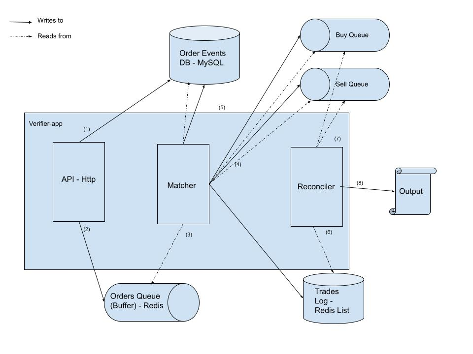

# Bitvavo - Order Book Coding Assignment

## Approach - Initial considerations

The chosen approach is founded on the idea of <i>production-level</i> code:
I developed a prototype that could easily be deployed to a cloud provider and serve real traffic, with code and architecture ready to scale to larger loads of traffic and potential decoupling in several services. For this reason I developed a web-app that can be reached via http requests instead of the command line, as I will describe later in the document.

I find design, in principle, a subjective matter where the exact balance between non-scalable and over-engineering code for a prototype lies on agreements between product and engineering rather than on a unique truth. Following this reasoning, I made several decisions while implementing the solution but I am aware that with more insights on the context some of them should be revisited:

<ul> <b> One monolith for the whole solution</b>: I believe that the split in multiple services could be a reasonable approach for a problem of this kind, although for a first version I decided to avoid the overhead of distributed systems. Regardless of that, the java packages are designed in a way that would make the decoupling and migration a more straightforward task: hexagonal architecture, no circular dependencies and clear interfaces between bounded contexts.
The common package was created to hold domain objects used by every other feature and still avoid circular dependencies, but I can foresee a future in which each context has a different understanding of what an Order is. </ul>

<ul> As we will see later in the document, the solution is based on an asynchronous architecture. Because of that, in case orders arrive at a highly concurrent pace it could happen that they are not strictly matched in the same order they arrived: I decided to accept the tradeoff and prioritize latency over strong consistency in this regard, but I acknowledge that an early conversation with a Product team could make me change this approach if my assumption is not correct.
In that case, I envision a solution based on locks (similar to how Kafka leverages Zookeeper’s locking style) in which only one instance can process orders at a time. </ul>

<ul> The solution runs with Docker compose in order to accurately express the nature of technologies I would opt for, keep data durability across different runs and make it runnable across platforms with ease. I added Prometheus and Grafana, as I consider monitoring and alerting a fundamental aspect of running software since the early stages of its life-cycle. Via browser, http://localhost:9090 can be used to access Prometheus, http://localhost:3000 for Grafana  </ul>
<ul> <b> Coding style</b>: I was fortunate to be exposed to diverse “coding schools” during my career and I tried to gather the benefits of each while keeping a pragmatic approach. In this direction, I base my solution primarily in SOLID principles, TDD and hexagonal architecture, using mocks only when a system interacts with the edges (ports). The fact that I embrace this approach doesn't invalidate alternative implementations of it or completely different approaches that respect good software foundations. In addition, you can perceive a certain style when creating objects or naming methods. I praise readability and I feel comfortable writing code like that, but I’m not strongly opinionated about it. I wouldn’t mind changing it if my team has other preferences. </ul>

 

## Design

The verifier-app is a monolith with three clear functionalities, which eventually could be easily migrated to different services:

<ul> <b>Api-http</b>: Receives http requests and places incoming requests in the Orders Queue. Once orders are persisted in the buffer we guarantee we won’t miss orders in case of unexpected downtime or unexpected bursts of traffic.
Additionally, persists an ORDER_PLACED event in MySQL. I consider event sourcing a powerful technique to serve as a source of truth in a distributed environment. In this solution it is mostly used to enforce idempotency, but it could help for audits, debugging and extra functionalities out of scope in this solution (email service, notifications service, user’s dashboard, etc.).
Regarding the queue, I could have opted for Kafka but I chose Redis because it also fits a second use case in this application. In a real scenario I wouldn’t choose a technology over another only for that reason. </ul>

<ul> <b>Matcher</b>: Reads incoming orders and matches them with orders stored in redis-based priority queues -one for buy and one for sell-.
As orders are partially or fully filled it appends ORDER_FILLED and ORDER_PARTIALLY_FILLED events to MySQL, while appending the trade to the redis-based TradesLog - a list built to help the reconciliation at a later stage.

* In addition to the note made on concurrency earlier in this document, let’s consider a scenario in which we have scaled up and we count with 2 instances of verifier-app running concurrently: while one order is picked up and momentarily removed from the queue by Instance A, InstanceB could try to match another order at the same instant. Even with low probabilities, this issue could arise in case of high traffic of concurrent nature and would make the introduction of distributed locks needed: only one instance can process orders for a specific product at a given time, with a queue (topic) for each product. 
</ul>

<ul> <b>Reconciler</b>: Reads pending orders from both queues and the TradesLog, applies MD5 hashing and returns the result.</ul> 

 

## How to run:

The introduction of Redis and MySQL would have made the use of a single JAR uncomfortable, while Docker Compose is a popular and straightforward solution for the use case at hand.
I’m aware that can make reviewers’ life a bit harder, and I hope the following commands in the _test-commands_ folder help to test the solution:

<b> runDockerCompose.sh</b>: Builds and runs the five docker images (verifier-app, Redis, MySQL, Prometheus and Grafana). If all goes well, it should create the <i>ordersDB</i> database and <i>order_events</i> table in MySQL. (I tested it several times but different environments could bring unexpected issues).

<b>postFile.sh <testFile></b>: <i>./test-commands/postFile.sh test1.txt </i> runs a curl request with the file attached

<b>cleanDB.sh</b>: The solution, ready for production, stores the data in durable docker volumes. I’m not sure how tests are run on your end, but if you need a clean slate then I would recommend running this script.

<b>stopDockerCompose.sh</b>: Stops running docker containers.

<b>Note I</b>: You may need to run <i>chmod +x test-commands/<file.sh> </i> beforehand.

<b>Note II</b>: To run tests (<i>mvn test </i> OR <i>mvn clean install</i>), docker service needs to be running.

 

## Out of scope

I decided to leave out of scope but nice to have for an internal prototype:
<ul>
Authorization and authentication.

CI/CD: deploy to the cloud with private or public IP.

Real passwords and key management.

Dead-letter queue.

Fallback solution if redis is down.

End to end integration tests.

If we expect high traffic in the future: Introduction of reactive tools and better use of multithreading since the beginning to avoid rewrites.
</ul>

